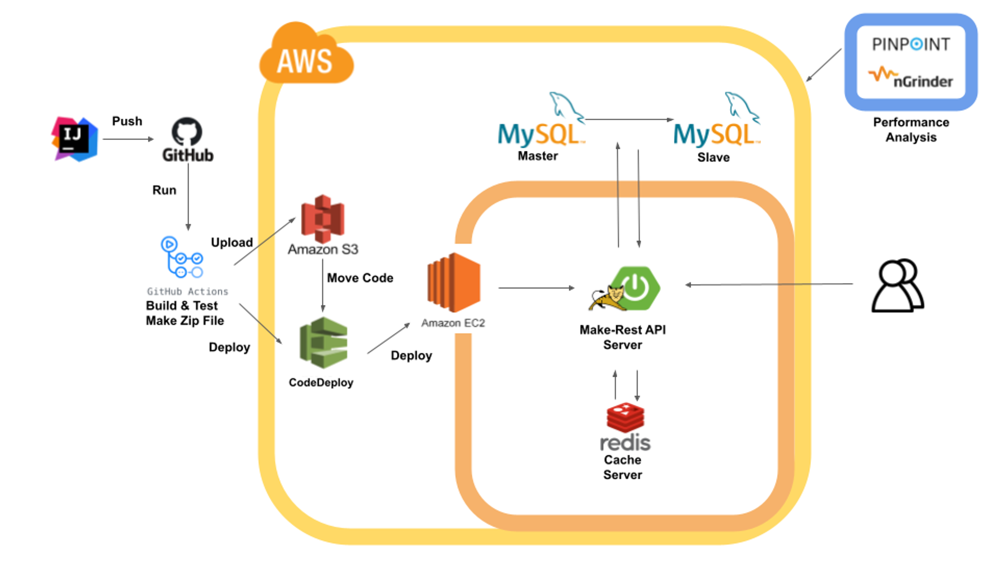
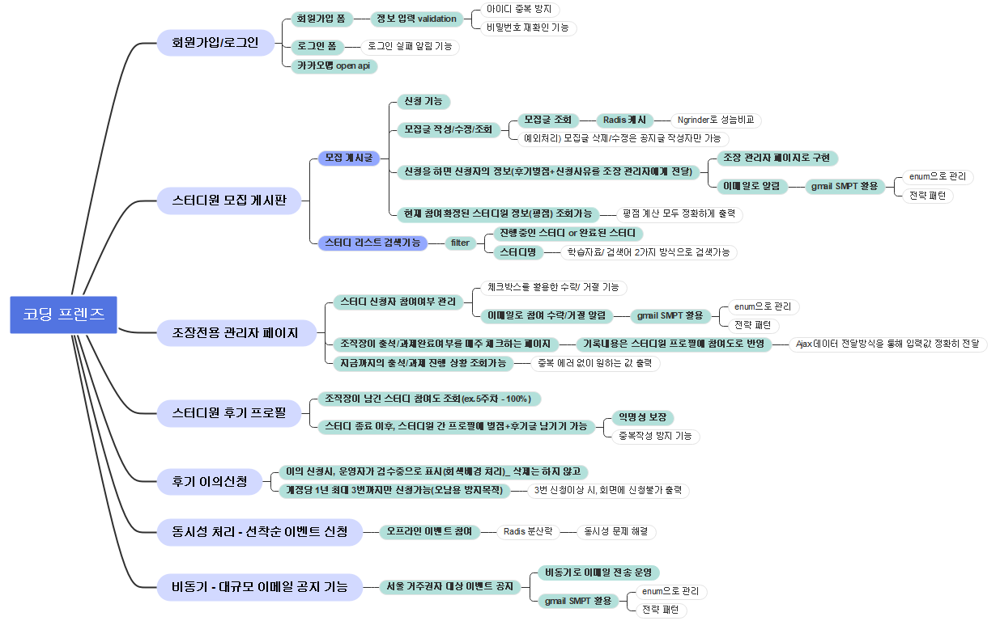
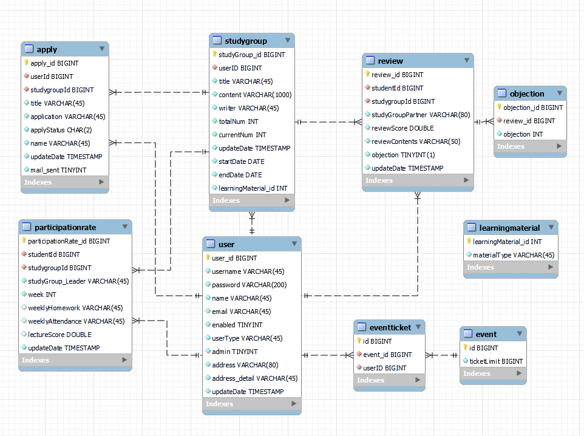

- [x] 리드미 작성
- [ ] 에러해결과정 정리
- [ ] 배포 링크 등록

	

	<h3>📚 "[REST API 서버] 개발자 스터디 모임 플랫폼" 📚</h3>

  

# 📖 개요
### 제안배경
- 온라인 스터디 도중 스터디원의 갑작스런 연락 중단을 경험
- 이에 문제인식을 느끼고 모임을 끝까지 마칠 수 있는 스터디 모임 플랫폼 제작  
  - 스터디 모임 종료후 → 모든 스터디원 참여 점수 공개(별점 및 리뷰글 기반)
  - 플랫폼 이름 = Coding Friends
      
- 해당 프로젝트는 기존 개발한 스터디 모임 플랫폼에서 서버를 분리 → [기능추가 및 리팩토링한 **REST API 서버**]
  - 기존 스터디 모임 플랫폼: https://github.com/SebinYu/CodingFriends-WEB
      
### [REST API 서버] 프로젝트 목표
- 스터디 모집 및 진행 → 진행 종료 후: 스터디원 참여 점수 공개(별점 및 리뷰글) API를 제공합니다.
- 기능과 더불어 해당 프로젝트는 3가지 핵심 가치를 반영합니다.
  - 성능향상
  - 대규모 트래픽 대처
  - 추후 기능추가 및 확장 가능성
       

# 📖 서버 구조도

   

# 📖 기술스택
- Back-end : Java11, Spring Boot 2.7.8, Spring Data JPA, Querydsl, JUnit5, Gradle
- Database: MySQL 8.0, MyBatis, Redis
- DevOps: AWS - EC2, S3, RDS, IAM, CodeDeploy
- CI/CD: Git Action
- Tools: IntelliJ, Ngrinder, Ubuntu, Vim, Git, Notion
     

# 🔥 프로젝트 중점사항 🔥
### 요약
- 성능향상 ( 쿼리튜닝 - 인덱스 , 비동기 방식 )
- 대규모 트래픽 대처 (Redis 캐시, DB Replication )
- 추후 기능추가 및 확장 가능성고려 (Enum, 전략 패턴, 기능단위 메서드 개발)
- 데이터베이스: (MySQL, JPA, Querydsl, 인덱스 설계)
- 예외처리: (동시성 이슈 - Redis 분산락, @ControllerAdvice - @ExceptionHandler, Querydsl을 통한 런타임에러 미연방지)
- 보안이슈: (회원 비밀번호 암호화/ 로그상 비밀번호 확인 제어)
- Git Flow
- 성능 테스트: (Pinpoint, VisualVM, Ngrinder )
     

# 📖 비즈니스 목표
스터디원이 모임 종료후 → 후기가 남는 것을 의식하여 모임을 끝까지 마칠 수 있는 스터디 모임 플랫폼 제작
### 비즈니스 목표 달성을 위한 기능 요구사항
🔵 파란색: 서비스/ 🟢초록색: 기능 구현 완료/ ⚪ 흰색: 기능 설명   

# 📖 ERD

